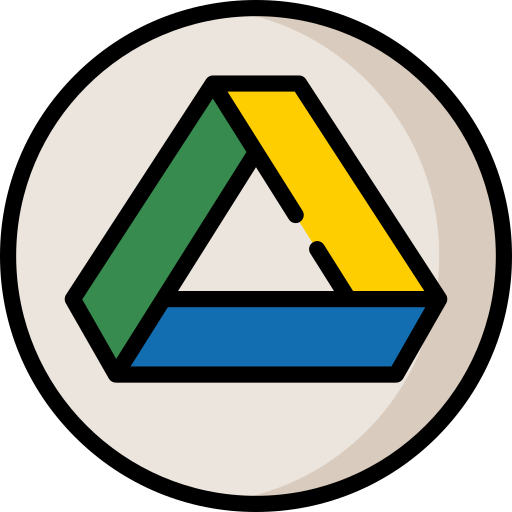

<p align="center">
  <a href="" rel="noopener">
 </a>
</p>

<h1 align="center">Drive Cli</h1>

<div align="center">

[](https://www.python.org/)
[](https://github.com/nurdtechie98/drive-cli/issues)
[](http://hits.dwyl.io/nurdtechie98/drive-cli)

Get the ability to access **Google Drive** without leaving your terminal.

</div>


------------------------------------------
### Features

- `view-file` :list your files, filter them by name,type.
- `clone` :download file/folder from drive using sharing link or file ID and get it linked 
- `add_remote` :upload existing local file to drive and get it linked
- `rm` :remove particular file or folder
- `ls` :list put all the files present in the drive of equivalent current directory
- `status` :list changes made to local files since last pull or pull
- `pull` :get latest changes from drive to local files
- `push` :push the changes made in remote to drive

------------------------------------------
### Installation

* Clone the directory
```sh
        $ git clone https://github.com/nurdtechie98/drive-cli.git
```
* Create your [OAuth ClientID](https://console.cloud.google.com/apis/credentials/oauthclient), download JSON file and place it inside drive-cli directory.
* Make Sure to enable [Google drive API](https://console.cloud.google.com/apis/library/drive.googleapis.com?q=drive)
* Install the requirements
```sh
    $ cd drive-cli
    $ pip install -e
```
* Login to Your Account
```sh
    $ python main.py
```
------------------------------------------
#### Usage
* Once installation and login is done, just use `drive` and the required command.
* Use `drive --help` for listing all the commands
* Use  `drive [command] --help` to list all the options available for each command
------------------------------------------
### Contributing

 * We're are open to `enhancements` & `bug-fixes` :smile:.
 * Feel free to add issues and submit patches

------------------------------------------
### Author
Chirag Shetty - [nurdtechie98](https://github.com/nurdtechie98)
See also the list of [contributors](https://github.com/nurdtechie98/drive-cli/graphs/contributors) who participated in this project.

------------------------------------------
### License
This project is licensed under the MIT - see the LICENSE(./LICENSE) file for details

