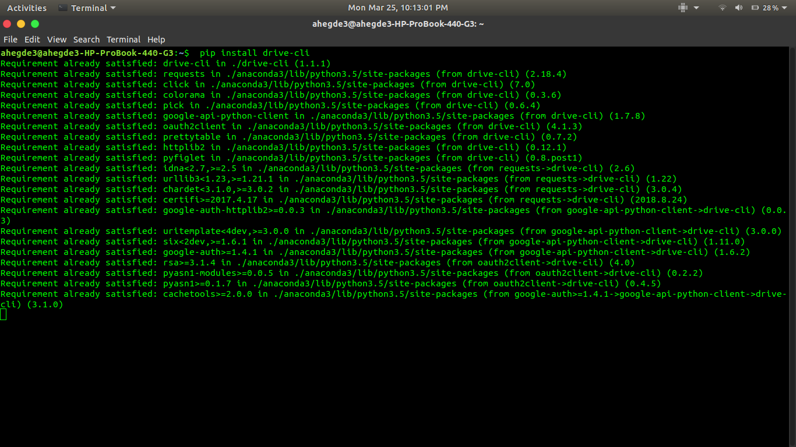

## for usage  
If you need to just use drive-cli directly, Drive-cli has a published pip package which you can use to get your installation done directly.

   
    
    
   

## for development
If you wish to contribute to the project/ modify it/build it locally you can setup development version of drive cli as well.

   

 
 
you will need an authentication file which will be unique to every user which you can download from <a href="https://console.cloud.google.com/apis/credentials/oauthclient">Oauth</a>

   

 
 
Fill the detail as per the requirement .You will be redirected to page from where client_secret.json can be downloaded.Rename it to oauth.json and place it in drive_cli directory.

   

Enable the <a href="https://console.cloud.google.com/apis/library/drive.googleapis.com?q=Drive">Drive Api</a>